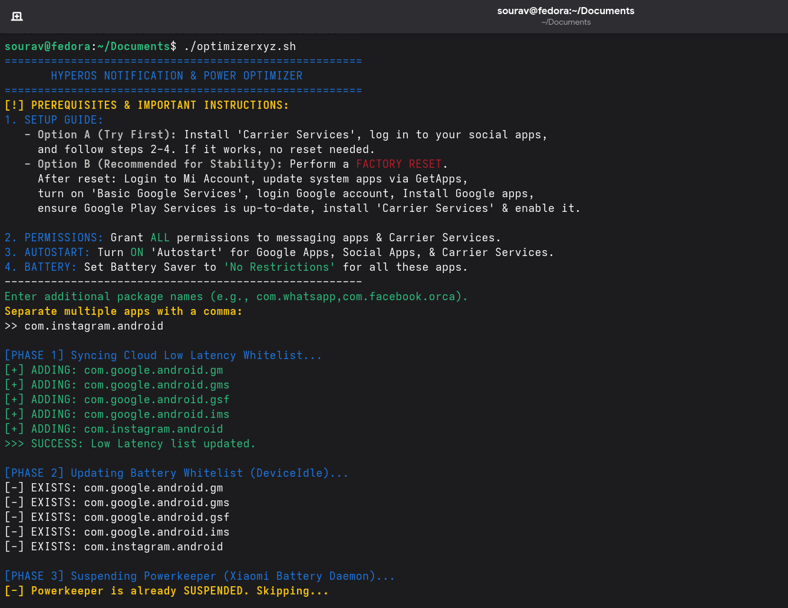

# 🚀 HyperOS Notification Fix (China ROM)

Fix delayed or missing notifications on China HyperOS devices using ADB tweaks, battery whitelist optimization, and PowerKeeper control.

---

## 📸 Preview

  

---

## 📌 Features

- ✅ Fix delayed notifications (WhatsApp, Messenger, Instagram, etc.)
- ⚡ Low Latency Whitelist optimization
- 🔋 Disable aggressive battery killing
- 🧠 Suspend MIUI/HyperOS PowerKeeper
- 🛠 Works on Linux & Termux
- ➕ Supports custom apps input

---

## ⚙️ Prerequisites

### 📱 On Your Phone:
- Enable Developer Options
- Enable USB Debugging
- Install Google Play Services (updated)
- Install Carrier Services
- Set apps to:
  - Autostart ON
  - Battery → No Restrictions
  - All permissions granted

---

## 🧰 Setup Guide

### 🔹 Option A (Quick Fix)
1. Install Carrier Services  
2. Login to apps  
3. Run script  

### 🔹 Option B (Recommended - Stable)
1. Factory Reset  
2. Login Mi Account  
3. Update system apps (GetApps)  
4. Enable Basic Google Services  
5. Login Google Account  
6. Install Google apps  
7. Update Play Services  
8. Install & enable Carrier Services  

---

## 💻 Usage (Linux)

### Install ADB
sudo dnf install android-tools   # Fedora  
sudo apt install adb             # Ubuntu/Debian  

### Connect Device
adb devices  

### Run Script
chmod +x hyperos_notification_fix.sh  
./hyperos_notification_fix.sh  

### Enter Apps
com.whatsapp,com.facebook.orca,com.instagram.android  

---

## 📱 Usage (Termux)

pkg update && pkg upgrade  
pkg install android-tools git  

adb pair IP:PORT  
adb connect IP:PORT  

chmod +x hyperos_notification_fix.sh  
./hyperos_notification_fix.sh  

---

## 🔄 What This Script Does

Phase 1: cloud_lowlatency_whitelist  
Phase 2: deviceidle whitelist  
Phase 3: suspend com.miui.powerkeeper  

---

## ⚠️ Important Notes

- Reboot after running script  
- Grant ALL permissions  
- Enable Autostart  
- Set Battery → No Restrictions  

---

## ♻️ Restore PowerKeeper

adb shell pm unsuspend com.miui.powerkeeper  

---

## 👨‍💻 Author

Sourav Debnath  

---

## ⭐ Support

Star ⭐ the repo if it helped!

---

## 📜 License

Open-source for educational & personal use.
